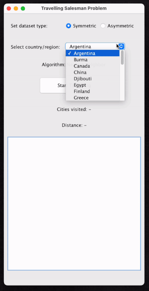

## Travelling Salesman Visualizer

Visualization of solutions to the Travelling Salesman Problem

### Datasets
1. Symmetric Dataset - University of Waterloo's National Travelling Salesman Problem dataset (https://www.math.uwaterloo.ca/tsp/world/countries.html)
This is a dataset with city maps of 25+ countries to choose from ranging from 38 cities (Djibouti) to 71009 cities (China).
2. Assymetric Dataset - Heidelberg Univesity's TSPLIB dataset (http://comopt.ifi.uni-heidelberg.de/software/TSPLIB95/)
This dataset is composed of the distance between each city in a matrix format as opposed to coordinates.

### Usage
Compile the source code and run TravellingSalesman. The default algorithm is Nearest Neighbor.

Step #1: Select the type of dataset

Step #2: Select the data you wish to visualize

Step #3: Run the app

### Custom Algorithm
To add your own algorithm and visualize it, 

Step #1: Add an algorithm name to the enum SymmetricAlgorithmTypes or AsymmetricAlgorithmTypes depending on which type of dataset you'd like to work with

Step #2: Write the algorithm as a Java function and add it to either SymmetricAlgorithm or AsymmetricAlgorithm, again, depending on the type of dataset

Step #3: Add another case in the switch statement in the runAlgorithm() function and call the algorithm as a parameter to data.setPoints()

Step #4: You're all set! Compile and select your new algorithm from the combo box to visualize your solution to the Travelling Salesman Problem

### Demo

### Data Format
Further details about the data format are provided here-
#### Symmetric Dataset
A Java ArrayList of points (x and y coordinates) is loaded from the tsp files. Your custom algorithm takes a SymmetricData object as input from which the points can be accessed. The solution is expected to be a sorted ArrayList of points in the order in which the salesman needs to travel which the algorithm should return.

#### Asymmetric Dataset
A Java ArrayList of ArrayList of Integers representing the cost of travel between cities is loaded from the atsp files. Your custom algorithm takes an AsymmetricData object as input from which this cost matrix can be accessed. The solution is expected to be a ArrayList of the path that the salesman needs to travel which the algorithm should return.